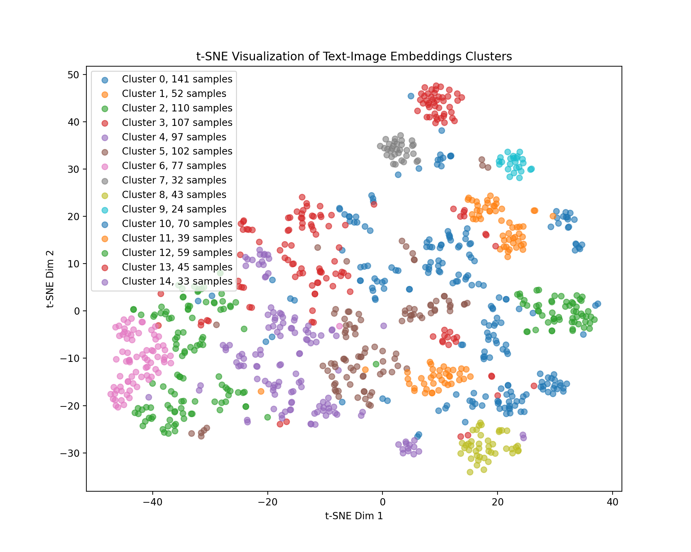

# A Simple Pipeline for T2I and Editing Eval Dataset Generation

## 本数据集构建思路

首先明确本数据集目标，需要在t2i和图像编辑两个任务上收集两种数据：
* t2i长文本指令集
* t2i复杂语义指令集
* 图像编辑多指令数据集
* 图像编辑复杂语义数据集

### 收集数据

阅读之前的论文，发现大家基本都是在MS COCO数据集上构造新的t2i数据集或是图像编辑数据集的，因此，我们也准备使用MS COCO数据集作为我们的原始数据集，提供图像和标注来源。

因为MS COCO的数据过多，我们首先从里面随机采样出10k条数据，然后分别获取其图片和标注。
之后，因为大多数图像编辑的输入图片长宽比例都是近似1:1的，所以我们首先进行过滤，过滤掉图片的长宽比例不在1:1.3 ~ 1.3:1之间的图片，剩下1031张图片。

对剩下的图片，我们使用gme-qwen2-vl-7b模型（这是一个多模态的embedding模型，可以同时输入文本与图片获得对应的embedding）对文本-图像对进行向量化，并使用层次聚类法进行聚类。我们总共聚类15类，对于每一类，我们从里面采样10个文本-图像对。最终，我们获得了150个语义丰富的样本，进行进一步操作。

经过聚类与采样，我们可以从MS COCO数据集中获取尽可能丰富的图片内容和语义信息，从而对之后构建的benchmark的多样性提供一个更好的准备。

聚类结果如下：



### 生成数据

有了候选的文本-图像对，接下来就是构建不同任务的具体指令了。在我们的方法中，指令的构建均有MLLM完成，或者说由qwen2.5-vl-72b-instruct进行构建。我们也尝试了qwen2.5-vl-32b-instruct，不过感觉其指令遵循远不如72b的版本，所以，我们最终选择qwen2.5-vl-72b-instruct作为我们的构建模型。
具体的prompt可以在附录看到。

对于长文本的t2i指令构建，主要关注点是不超过256个token，还有就是从4个任务中选择一个任务并进行生成：
1. Accurate count of multiple objects
2. Multiple objects + attributes
3. Multiple objects + absolute positions
4. Multiple objects + scene description

我们规定的了模型的回答格式，选择的任务放在`<task></task>`中，最后生成的指令放在`<answer></answer>`中。

对于复杂语义的t2i指令构建，跟之前差不多，不过强调了指令需要具有一定的推理性。

对于多指令的图像编辑数据构建，我们限制模型构建3条独立的图像编辑指令。模型首先会选择一个任务的类型，然后针对这个任务生成三条指令。具体的任务如下所示：
1. Object management (add/remove objects)
2. Attribute editing (modify properties like color/texture)
3. Scene transformation (change background/style)

复杂语义的图像编辑数据构建，和之前差不多，除了只需要一条指令，并强调指令需要有一定的可推理的语义。

最后，我们还会通过观察，人工对数据进行过滤，筛选出质量更高的数据集。

## 本代码使用流程

本代码有4个需要执行的程序，分别是：
* `data.py`：运行后，负责mscoco数据集中图像部分的下载（我将下载好的10k张图片放在了`image_cache.zip`中，如果将其解压放在`./data/image_cache`下，就不需要执行这个代码）
* `get_img_embedding.py`：首先对图片长宽进行过滤，然后通过请求向量化模型，来获取所有的文本图像对的向量。同时，将向量经过t-sne进行降维，输出聚类效果图。
* `clustering.py`: 针对文本图像对的向量，进行聚类，并抽取其中的不同类别的数据构建我们的benchmark初始数据集。
* `generate_data.py`：基于上面的初始数据集，通过请求MLLM，获得可接受的四种指令，并分别单独保存为四个数据集。

最后，如果需要的话，可以使用`show_html.py`，对上面四个数据集进行可视化。

具体来说，可以使用如下的代码，可以详细修改其中的配置：
```bash
# 0. 下载数据（可修改保存路径）
wget https://huggingface.co/datasets/ChristophSchuhmann/MS_COCO_2017_URL_TEXT/resolve/main/mscoco.parquet?download=true -O data/mscoco.parquet

# 1. 下载数据集中的图片
sh sh/run_data.sh

# 2. 首先进行初步过滤，然后使用transformers库调用gme-qwen2-vl-7b，对文本图像对进行向量化
# （建议修改其中的参数，如模型加载路径、gpu配置等）
sh sh/run_get_img_embedding.sh

# 3. 对向量化数据进行聚类，选择其中的子集，同时输出聚类的可视化结果
sh sh/run_clustering.sh

# 4. 基于该子集，进行四种数据集的构建
sh sh/start_qwen_server.sh  # 使用vllm serve构建服务器（建议修改其中的参数，如模型加载路径、gpu配置等）
sh sh/run_generation.sh  # 请求该服务器，分别收集四种类型的数据

# 最后可以进行html可视化
python show_html.py
```

上述代码已经过测试。环境的话可以使用`pip install -r requirements.txt`进行安装，没有太多东西，也可以单独进行安装。